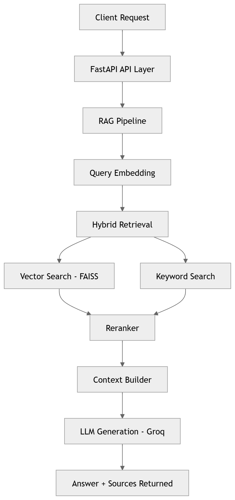

TechDocs RAG System

A Retrieval-Augmented Generation system for answering technical documentation questions using semantic search and large language models.

Instead of letting a model guess answers, this system retrieves relevant documentation chunks, reranks them, and generates answers grounded strictly in the retrieved sources.

Built with FastAPI, FAISS, LangChain, and inference via Groq.

<h2 align="center">Architecture</h2>

  

